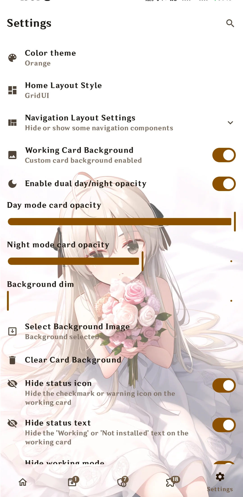
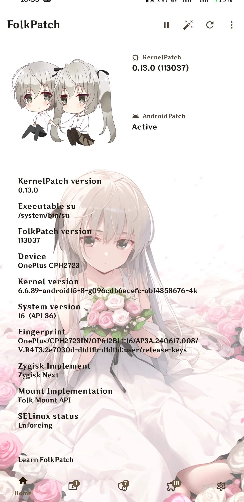
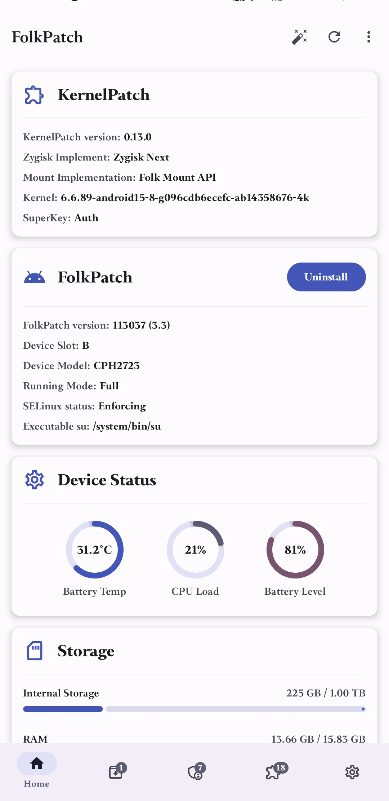
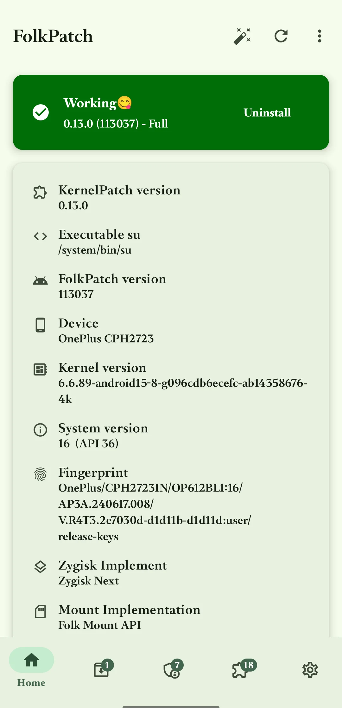

🌏 **README 语言:** [**English**](./README_EN.md) / [**中文**](./README.md) / [**日本語**](./README_JA.md)

FolkPatch - 专注界面优化与功能扩展的Root管理工具

通过我们的综合文档快速开始。无论是安装使用、模块管理，还是自定义设置，文档涵盖了您成功使用FolkPatch所需的所有内容。

[📚 阅读完整文档](https://fp.mysqil.com/) →

<table>
  <tr>
    <td></td>
    <td></td>
    <td></td>
  <tr>
  <tr>
    <td></td>
    <td></td>
    <td></td>
  <tr>
</table>

## 🚀 NEW: 核心功能优化

> **🎯 智能模块管理** - 全自动KPM加载机制，无需嵌入Boot，提供更稳定的Root体验

### 🔧 模块系统重构
- **APM批量刷入系统：** 支持类似Magisk的模块系统，支持批量刷入，更加快捷高效
- **KPM自动化加载：** 支持将任何代码注入内核的模块，全自动加载机制，无需手动嵌入
- **模块全量备份：** 一键备份所有模块，只管安心体验Root，安全无忧

### 📐 界面设计优化
- **自定义壁纸系统：** 更好的自定义系统，支持自定义壁纸，打造专属个性化界面
- **现代化UI设计：** 精心优化的界面设计，提供流畅的视觉体验
- **多语言支持：** 多种特色语言，随心切换

### 🛠 功能特性增强
- **在线模块下载：** 集成在线模块下载功能，快速获取热门模块
- **全局模块排除：** 模块全局排除功能，操作更加快速便捷
- **移除自动更新：** 移除自动更新功能，提供更稳定的用户体验

---

## ✨ 功能特性

### 🎨 核心功能
- [x] 基于内核的Android设备Root解决方案
- [x] 支持 ARM64 架构设备
- [x] 支持 Android 内核版本 3.18 - 6.12
- [x] APM：支持类似Magisk的模块系统
- [x] KPM：支持内核注入模块（提供内核函数 `inline-hook` 和 `syscall-table-hook`）

### 🎨 界面与设计
- [x] 优化的现代化界面设计
- [x] 支持自定义壁纸
- [x] 多语言支持
- [x] 流畅的用户体验
- [x] 精美的视觉效果

### 📦 模块系统
- [x] 批量刷入APM模块
- [x] 全自动KPM加载机制
- [x] 模块全量备份功能
- [x] 全局模块排除
- [x] 在线模块下载

### ⚡ 技术特性
- [x] 基于 [KernelPatch](https://github.com/bmax121/KernelPatch/) 核心
- [x] 移除自动更新，提供稳定体验
- [x] 无需嵌入Boot的KPM加载
- [x] 智能模块管理

## 🚀 下载安装

### 📦 安装

1. **下载安装：**
   从 [发布页面](https://github.com/matsuzaka-yuki/FolkPatch/releases/latest) 下载最新的APK文件

2. **安装应用：**
   直接安装APK文件到您的Android设备

3. **开始使用：**
   打开FolkPatch应用，按照指引完成Root设置

### 📱 系统要求

- **架构：** 支持 ARM64 架构
- **内核版本：** 支持 Android 内核版本 3.18 - 6.12

## 🙏 开源致谢

本项目基于以下开源项目：

- [KernelPatch](https://github.com/bmax121/KernelPatch/) - 核心组件
- [Magisk](https://github.com/topjohnwu/Magisk) - magiskboot和magiskpolicy
- [KernelSU](https://github.com/tiann/KernelSU) - 应用UI和类似Magisk的模块支持
- [Sukisu-Ultra](https://github.com/SukiSU-Ultra/SukiSU-Ultra) - 参考一些界面的设计
- [APatch](https://github.com/bmax121/APatch) - 上游分支

## 📄 许可证

FolkPatch 遵循 [GNU General Public License v3 (GPL-3)](http://www.gnu.org/copyleft/gpl.html) 许可证开源。

## 💬 社区交流

### FolkPatch讨论交流
- Telegram 频道: [@FolkPatch](https://t.me/FolkPatch)
- QQ群: 1074588103
